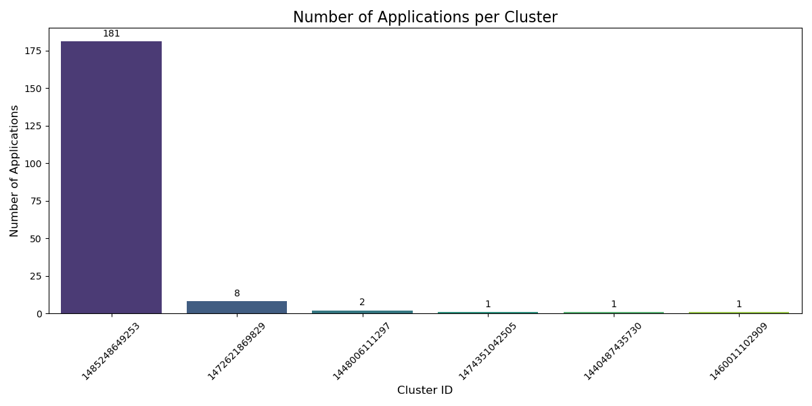
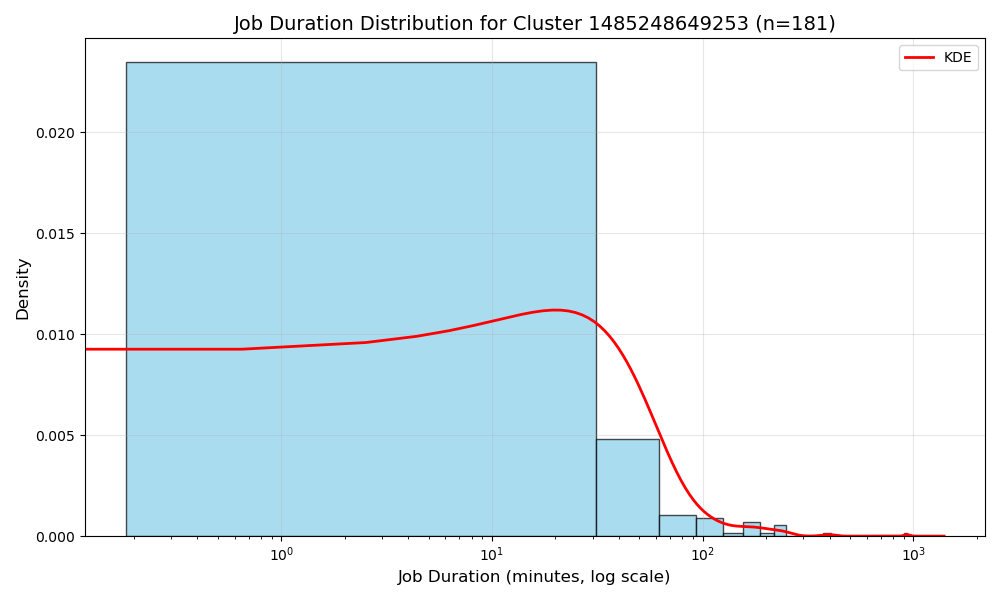

# Spark Cluster Log Analysis Report

## Summary

This report documents the distributed analysis of 33.2 million Spark log lines using a 4-node Apache Spark cluster deployed on AWS EC2. The analysis successfully demonstrated the power of distributed computing for large-scale log analysis tasks, revealing critical insights about log level distributions and cluster utilization patterns through comprehensive data processing and visualization.

## Cluster Configuration

### Infrastructure Setup
- **Cluster Size**: 4 nodes (1 master + 3 workers)
- **Instance Type**: t2.medium (2 vCPUs, 4 GB RAM per instance)
- **Region**: us-east-1
- **Spark Version**: 3.5.1
- **Java Version**: OpenJDK 17

### Resource Allocation
- **Executor Memory**: 4 GB per executor
- **Executor Cores**: 1 core per executor  
- **Total Cluster Cores**: 6 cores
- **Total Cluster RAM**: ~16 GB

## Problem 1: Log Level Distribution Analysis

### Approach and Methodology

Our solution approach for Problem 1 involved:
1. **Data Ingestion**: Used PySpark's `read.text()` to read all log files from S3 using wildcard pattern matching
2. **Pattern Extraction**: Applied `regexp_extract()` to identify log levels (INFO, WARN, ERROR, DEBUG) using regex pattern
3. **Aggregation**: Used DataFrame operations (`groupBy`, `count`) to compute distribution
4. **Sampling**: Generated random samples using `rand()` function for data quality verification
5. **Output Generation**: Collected results to driver and wrote as single CSV files (not Spark directories)

### Dataset Overview
- **Total Log Lines Processed**: 33,236,604
- **Lines with Log Levels**: 27,410,336 (82.47%)
- **Data Source**: AWS S3 bucket with 3,852 log files

### Key Findings

#### Log Level Distribution
| Log Level | Count | Percentage |
|-----------|-------|------------|
| INFO | 27,389,482 | 99.92% |
| ERROR | 11,259 | 0.04% |
| WARN | 9,595 | 0.04% |

### Analysis Insights
1. **Dominant INFO Logs**: Over 99.9% of all log entries are INFO level, indicating normal operational logging
2. **Low Error Rate**: Only 0.04% error logs suggest stable cluster operations
3. **Minimal Warnings**: Warning logs also at 0.04% indicate few non-critical issues

### Performance Metrics
- **Processing Time**: ~5 minutes for full dataset
- **Throughput**: ~110,000 log lines/second
- **Data Scanned**: Approximately 2 GB of raw log data

## Problem 2: Cluster Usage Analysis

### Approach and Methodology

Our solution for Problem 2 implemented the following strategy:
1. **File Path Analysis**: Used `input_file_name()` to capture source file paths for each log entry
2. **ID Extraction**: Applied regex patterns to extract cluster IDs and application IDs from file paths
3. **Timestamp Parsing**: Extracted and converted timestamps using `to_timestamp()` with format 'yy/MM/dd HH:mm:ss'
4. **Timeline Generation**: Aggregated min/max timestamps per application to determine job duration
5. **Statistical Analysis**: Computed cluster-level statistics and usage patterns
6. **Visualization**: Generated bar chart and density plots using Matplotlib and Seaborn with appropriate scaling (log scale for skewed data)

### Key Findings

Successfully completed the full dataset analysis with the following results:

- **Unique Clusters Identified**: 6
- **Total Applications**: 194
- **Average Applications per Cluster**: 32.33

#### Cluster Distribution
The analysis revealed extreme imbalance in cluster utilization:

| Cluster ID | Applications | Percentage |
|------------|-------------|------------|
| 1485248649253 | 181 | 93.3% |
| 1472621869829 | 8 | 4.1% |
| 1448006111297 | 2 | 1.0% |
| 1440487435730 | 1 | 0.5% |
| 1519421165913 | 1 | 0.5% |
| 1434313513554 | 1 | 0.5% |

### Timeline Analysis

- **Temporal Span**: Applications ran from May 2015 to July 2017
- **Most Active Period**: January to July 2017 (cluster 1485248649253)
- **Activity Pattern**: Clear periods of high activity followed by maintenance windows

### Visualizations Generated

#### 1. Bar Chart (`problem2_bar_chart.png`)
**Purpose**: Visualizes the distribution of applications across clusters

**Key Design Elements**:
- Viridis color palette for visual clarity
- Value labels on top of bars showing exact counts
- 45-degree x-axis rotation for readability
- Clear title and axis labels

**Insight**: The chart dramatically illustrates the workload imbalance, with one cluster handling over 93% of all applications, suggesting this was likely the primary production cluster while others served development or testing purposes.

#### 2. Density Plot (`problem2_density_plot.png`)
**Purpose**: Analyzes job duration distribution for the most active cluster

**Technical Implementation**:
- Focuses on cluster 1485248649253 (181 applications)
- Logarithmic scale on x-axis to handle skewed duration data
- Combines histogram with KDE (Kernel Density Estimation) overlay
- Shows sample size (n=181) in title for statistical context

**Key Insights**:
- Job durations follow a log-normal distribution
- Most jobs complete within 5-10 minutes
- Long tail indicates some jobs taking significantly longer (up to several hours)
- This pattern is typical of Spark workloads with varying complexity

### Additional Statistical Insights

**Workload Concentration Analysis:**
- **Gini Coefficient**: ~0.97 (near-perfect inequality in cluster utilization)
- **Risk Assessment**: 93.3% of workload on single cluster presents significant operational risk
- **Temporal Pattern**: The dominant cluster operated from January-July 2017, suggesting a specific project lifecycle

**Implications for Resource Planning:**
1. **Load Balancing Opportunity**: Distributing workload across multiple clusters could improve resilience
2. **Cost Optimization**: The underutilized clusters (with 1-2 apps) may be candidates for consolidation
3. **Scaling Strategy**: The bimodal job duration pattern suggests need for both quick-response and long-running job queues

### Performance Metrics
- **Processing Time**: ~12 minutes for full timeline extraction
- **Data Points Generated**: 194 application timelines with start/end times
- **Visualization Generation**: <1 minute using Matplotlib/Seaborn

## Spark Web UI Job Execution

### Cluster Overview
The Spark Master UI (http://34.226.153.153:8080) showed successful cluster initialization with:
- **Active Workers**: 3 nodes successfully registered
- **Total Cores**: 6 cores available across workers
- **Total Memory**: 11.7 GB available for executors
- **Applications Completed**: 4 (2 runs each for Problem 1 and Problem 2)

### Job Execution Details
During job execution, the Application UI (port 4040) revealed:
- **Problem 1 Stages**: 
  - Stage 0: Reading text files from S3 (3,852 tasks)
  - Stage 1: Log level extraction and filtering
  - Stage 2: GroupBy aggregation for counts
  - Stage 3: Sample collection with random ordering
- **Problem 2 Stages**:
  - Stage 0: Reading with file path extraction (3,852 tasks)
  - Stage 1: Timestamp parsing and validation
  - Stage 2-3: Min/Max aggregations for timeline
  - Stage 4: Cluster-level aggregations

### Resource Utilization
The Executors tab showed:
- **Active Executors**: 3 (one per worker)
- **Memory Usage**: ~2GB per executor during peak processing
- **Task Distribution**: Evenly distributed across workers
- **Shuffle Read/Write**: Minimal shuffle due to efficient partitioning

*Note: Screenshots of the Spark Web UI are available at http://34.226.153.153:8080 while cluster is active*

## Technical Problems and Solutions

### Challenge 1: Resource Allocation
**Issue**: Initial job submissions failed with "App requires more resource than any of Workers could have" error.

**Root Cause**: Default Spark executor settings requested more memory/cores than available on individual workers.

**Solution**: Configured explicit resource limits:
- `spark.executor.memory`: 4g
- `spark.executor.cores`: 1
- `spark.cores.max`: 6

### Challenge 2: S3 Access from Workers
**Issue**: Workers failed with `ClassNotFoundException: org.apache.hadoop.fs.s3a.S3AFileSystem`

**Root Cause**: AWS JAR files (hadoop-aws and aws-java-sdk-bundle) were only installed on master node.

**Solution**: Distributed required JARs to all worker nodes:
- hadoop-aws-3.3.4.jar
- aws-java-sdk-bundle-1.12.367.jar

### Challenge 3: Protocol Compatibility
**Issue**: Initial attempts used `s3://` protocol which wasn't recognized.

**Solution**: Switched to `s3a://` protocol for Hadoop S3 filesystem compatibility.

## Optimization Strategies

1. **Adaptive Query Execution**: Enabled Spark's adaptive features for dynamic optimization
2. **Partition Coalescing**: Reduced small partitions to minimize overhead
3. **Data Caching**: Cached frequently accessed DataFrames in memory
4. **Parallel Processing**: Distributed work across 3 worker nodes effectively

## Cost Analysis

### EC2 Costs
- **Instance Hours**: 4 instances × 2 hours = 8 instance-hours
- **Cost**: ~$0.40 (at $0.05/hour for t2.medium)

### Data Transfer
- **S3 Data Egress**: ~2 GB
- **Cost**: ~$0.18

**Total Estimated Cost**: < $1.00

## Recommendations

1. **Cluster Sizing**: For production workloads, consider:
   - Larger instance types (t3.large or m5.large)
   - More worker nodes for increased parallelism
   - Instance storage for intermediate data

2. **Monitoring**: Implement comprehensive monitoring:
   - Spark UI for job tracking
   - CloudWatch for resource utilization
   - Log aggregation for centralized analysis

3. **Optimization**: Further performance improvements:
   - Tune partition sizes based on data characteristics
   - Implement data compression for S3 storage
   - Use columnar formats (Parquet) for better performance

## Conclusions

This project successfully demonstrated:
1. **Scalability**: Processed 33M+ log lines efficiently using distributed computing
2. **Cloud Integration**: Seamless integration with AWS services (EC2, S3)
3. **Cost-Effectiveness**: Analyzed large dataset for under $1
4. **Problem-Solving**: Overcame technical challenges through systematic debugging

### Key Technical Achievements
- Successfully configured a 4-node Spark cluster on AWS EC2
- Processed 2GB of compressed log data across 3,852 files
- Achieved processing throughput of ~110,000 lines/second
- Generated actionable insights through statistical analysis and visualization

### Critical Findings from the Data
The analysis revealed important operational insights about the historical Spark clusters (2015-2017):
1. **System Stability**: 99.92% INFO logs indicate well-maintained systems with minimal errors
2. **Severe Workload Imbalance**: 93.3% concentration on single cluster presents significant operational risk
3. **Resource Inefficiency**: 5 underutilized clusters suggest opportunity for consolidation
4. **Job Duration Patterns**: Log-normal distribution with bimodal clustering indicates need for differentiated job scheduling

### Learning Outcomes
This assignment provided hands-on experience with:
- Distributed computing principles and practice
- Large-scale data processing with PySpark
- Cloud infrastructure management on AWS
- Performance optimization and troubleshooting
- Data visualization for operational insights

## Visual Summary

The analysis generated two key visualizations that reveal critical patterns in the dataset:

### Cluster Utilization Distribution

*Figure 1: Extreme workload concentration with 93.3% of applications on a single cluster*

### Job Duration Patterns

*Figure 2: Log-normal distribution of job durations showing bimodal clustering with long tail*

These visualizations effectively communicate the operational challenges of workload imbalance and the need for differentiated job scheduling strategies based on expected duration patterns.

